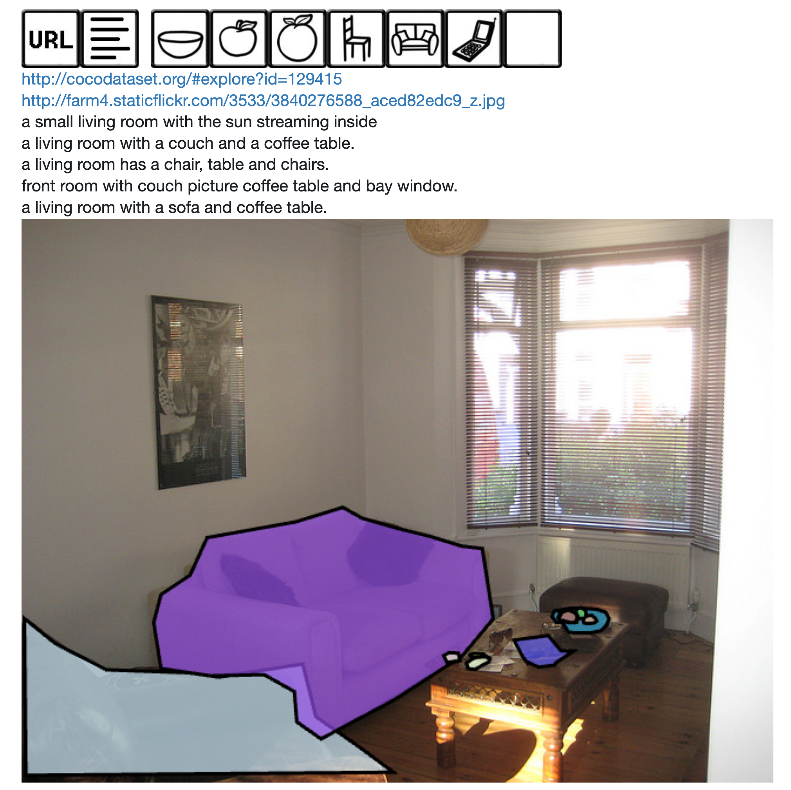
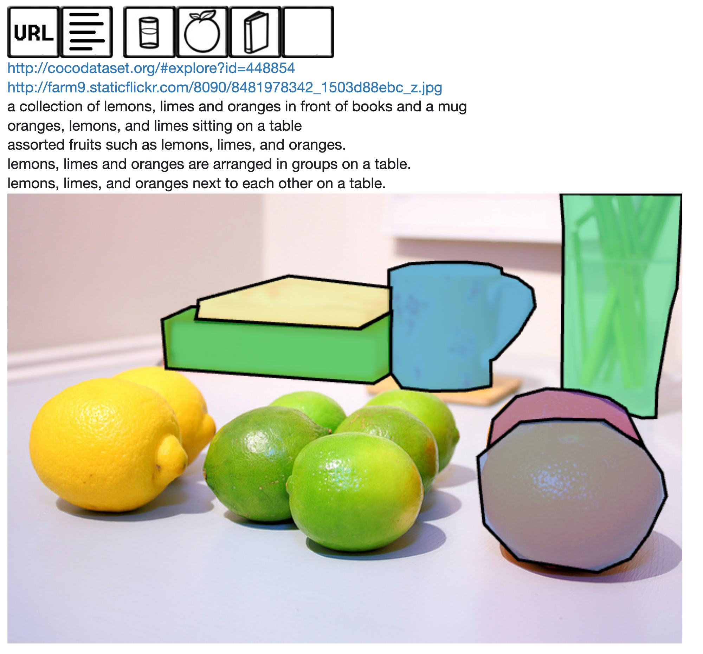
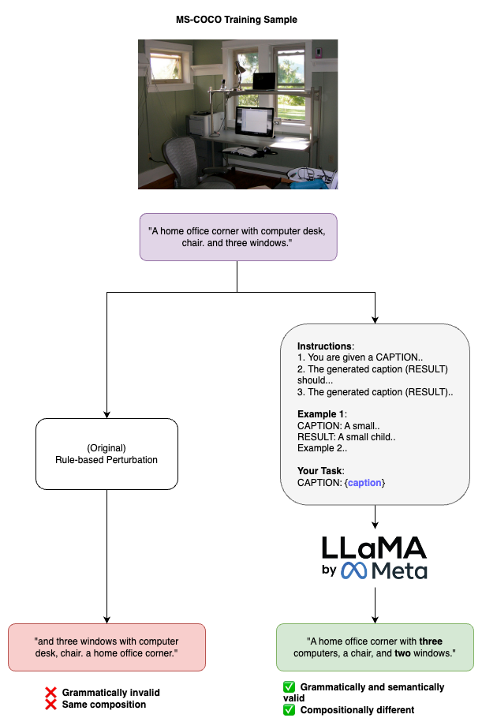
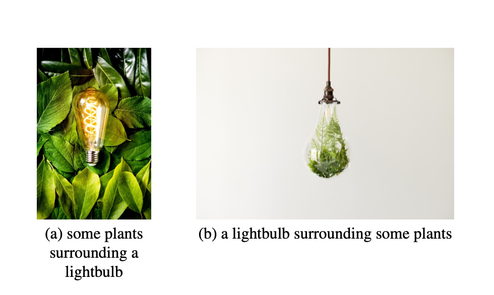

## Team Members:
- Archana Kutumbaka
- Siddharth Sriraman

[GitHub Repo](https://github.com/archana53/diffusion-itm/) (training code is in the main branch, and benchmarking code is in the [inference](https://github.com/archana53/diffusion-itm/tree/inference) branch)
[GitHub Website Repo](https://github.com/sid-sr/CS6476_Website/)

## Introduction / Problem Definition: 
**High-level Description and Motivation**: Diffusion models operate by gradually transforming random noise into a coherent output (like an image, audio, or video) through a process that iteratively refines the output by predicting and removing noise at each step, guided by learned data patterns. This unique approach allows them to scale up to mega-resolutions, enabling the creation of highly detailed and imaginative outputs across various forms of media, showcasing their remarkable ability to synthesize complex and nuanced content.

**Specific Problem Definition**: One significant challenge that diffusion models face is their struggle with compositionality, specifically their difficulty in understanding how different attributes are interconnected and in learning the rules for combining these attributes from language descriptions. For instance, diffusion models often fail to generate distinctly different outputs for descriptions like "a sheep to the right of a goat" versus "a goat to the right of a sheep." This limitation hampers their performance in visio-linguistic reasoning tasks, such as accurately matching images with text descriptions or vice versa. We believe this issue arises primarily due to the diffusion models' training approach, which lacks a mechanism for penalizing incorrect examples, unlike contrastive learning methods that specifically reinforce correct associations and penalize incorrect ones. Additionally, the reliance on CLIP-based text encoders, which have inherent weaknesses in handling complex visio-linguistic compositions, exacerbates this problem. 

**Visual Example**:

||
|:-:|
|Figure 1: Example of Stable Diffusion text-to-image generation from the DrawBench prompts [10], image shown in [1, Figure 5a].|

Figure 1 is an example of poor compositional reasoning. The prompt given to Stable Diffusion [6] is "_A stack of 3 books. A green book is on the top, sitting on a red book. The blue book is on the bottom._" It does generate a stack of books but the relative positioning is not as expected. 

### Related Works: 

#### Methods

The following are two motivating approaches that we build upon:

Yuksekgonul et al. [2] show that state-of-the-art Vision and Language Models (VLMs) perform poorly on image generation tasks that involve compositionality. They curate a benchmark dataset of image-text pairs that cover various types of Attributes, Relations and Order (ARO) information. They generate misordered hard-negatives through rule-based perturbation of words in the captions. They show that state-of-the-art VLMs are not sensitive to ordering of objects, and instead behave like a bag-of-words model, and that this is incentivised by the set up of training objectives and datasets for retrieval tasks. They conduct experiments to show that composition-aware hard negative mining (of both images and captions) significantly improves compositionality and ordering performance.

Krojer et al. [1] attempts to solve this problem by fine-tuning a pre-trained diffusion model using a loss that maximizes error predicted for negative samples and minimizes error for the positive sample. They generate image negatives with CLIP [5] and text negatives using the rule-based perturbation method from [2]. They also propose _DiffusionITM_, a scheme that converts a generative model to a discriminative zero-shot image-text matching model, which allows generative models to now be tested on discriminative vision-and-language benchmarks. They also introduce GDBench, a benchmark dataset consisting of image-text pairs that capture a wide range of compositions.

We also found alternate approaches that focus on compositionality performance:

Qu et al. [3] aim to solve the text-to-image misalignment problem by improving the intrinsic compositional reasoning of generative models. To do this, they propose a two-stage scheme called Discriminative Probing and Tuning (DPT). The probing stage involves passing the latent space of the U-Net of a generative model like Stable Diffusion [6] (SD) through a discriminative adapter model that probes into its local (referring expression comprehension) and global grounding (image-text matching) abilities. The tuning stage involves parameter-efficient fine-tuning using LoRA [7]. They use this adapter in inference to improve compositionality performance in denoising-based text-to-image generation.

Basu et al. [4] improve visuo-linguistic reasoning in CLIP [5] by modifying its standard loss to include a distillation loss component from a text-to-image model such as Stable Diffusion. They linearly map CLIP’s image encoder output into the SD’s U-Net input space, and learn this map by adding the denoising diffusion score to the CLIP loss. While the compositionality performance still remains bounded by SD’s abilities, they show that CLIP achieves significantly better visuo-linguistic reasoning by integrating knowledge from diffusion models.

#### Benchmarks

In addition to the ARO and GDBench benchmarks discussed above, we found other benchmarks specific to compositionality. Thrush et al. [8] introduce Winoground, a carefully hand-crafted benchmark dataset of 1600 image-text pairs (800 being correct and 800 being incorrect) that differ in word ordering. They validate the result in [1], that VLMs show poor performance (close to random chance) when it comes to compositionality in retrieval tasks. 

#### Our project in context

The works in this space are mainly divided into _data-centric_ approaches [2] and _model-centric_ approaches [1] [3]. Our project modifies key aspects of both these approaches and tests them separately. Specifically, we believe grammatical and semantic validity of hard-negative generation is important (missing in [2]), and orthogonally, we aim to relax of the requirement of difficult-to-generate hard-negatives in the first place, by reformulating the training objective for image retrieval.

### Methods / Approach:

We propose two orthogonal methods to help improve compositionality performance.

#### Method 1 Overview

Following [1], we hypothesize that unconditional (no text) error prediction for a given image marginalizes the probability over the text dimension. They leverage this finding, to normalize the error predicted conditionally by this unconditional value and use the residue for the image retrieval task. In addition, they use hard negatives to contrastively finetune the diffusion backbone using the loss in equation (1).

$$ \mathcal{L}_{\text{hard-neg}} = \mathcal{L}_{\text{pos}} + \text{clip}(\mathcal{L}_{\text{neg}}, |\lambda\mathcal{L}_{\text{pos}}|) \tag{1} $$

where 

$$ \mathcal{L}_{\text{pos}} = {\mathbb{E}}_{x,t} [\|\mathbf{e} - \mathbf{e}_{\theta}(x, t, w_{\text{pos}})\|_2^2] $$

$$ \mathcal{L}_{\text{neg}} = -{\mathbb{E}}_{x,t} [\|\mathbf{e} - \mathbf{e}_{\theta}(x, t, w_{\text{neg}})\|_2^2] $$

#### Method 1 Contribution

In contrast, we propose a soft negative training policy that directly finetunes the diffusion model to minimize a new loss function in Equation 2 that ensures that the correct caption is preferred over all other caption possibilities without the use of explicit negatives.

$$
\mathcal{L}_{\text{soft-neg}} = \mathbb{E}_{x,t} \left[ \left( \| \mathbf{e} - \mathbf{e}_{\theta}(x, t, w) \|_2^2 - \| \mathbf{e} - \mathbf{e}_{\theta} (x, t) \|_2^2 \right) \right]  \tag{2}
$$

#### Method 1 Intuition

We believe that this loss eliminates the need for creating hard-negatives and generating them by using swapping nouns similar to [2]. It would also allow for more stable training without the need for clipping and regularizing to gatekeep potentially infinite gains. 

#### Method 2 Overview

In the second orthogonal approach, we use orignal contrastive loss function as [2], but aim to improve the quality of text hard-negatives used instead, where they use rule-based noun, adjective and verb reordering to generate compositionally confusing captions for images from MS-COCO. 

For this, we first inspected MS-COCO to understand which aspects of compositionality it captures and which it does not. We saw that while it captures compositional information about a scene, it does not capture fine-grained information about where each object is located. For example, the following image has a caption of "a living room with a couch and a coffee table", but does not describe the relative position of the couch with respect to the coffee table.

||
|:-:|
|Figure 2: Example from MS-COCO|

Similar to the above case, we also noted that ordering of items in the captions are not consistent with the ordering in the images. Different captions have different orderings. For example, in the following image, one caption captures an ordering that is inconsistent with the others.

||
|:-:|
|Figure 3: Example from MS-COCO|

However, we are ultimately bounded by the MS-COCO dataset, since datasets with high-quality compositional information like Winoground are difficult to manually curate and are hence very small (800 samples) and infeasible to fine-tune with. So instead, we aim to improve the hard-negative mining method used by Yuksukgonul et al. [2]. The generated captions in their method currently do not semantically and gramatically make sense. For example, their COCO-Order component of ARO cites an example where they perturb the caption "A brown cat is looking at a gray dog sitting in a white bathtub" to "at brown cat a in looking a gray dog sitting is and a white bathtub" through shuffing all but adjectives and nouns.

Concretely, their strategy uses four perturbation rules for each caption: 1) Shuffle nouns and adjectives, 2) Shuffle everything but nouns and adjectives, 3) Shuffle trigrams and 4) Shuffle words within each trigram. Rule 3 and 4 can lead to gramatically incorrect sentences.

#### Method 2 Contribution

Generating grammatically and semantically valid hard negatives is difficult to automate as it requires linguistic reasoning, this is a task large language models (LLMs) could deal with. We use LLaMA-2 [9], a large foundation model capable of text generation, to generate semantically and gramatically valid hard-negatives of captions in MS-COCO and train SD as in [2] to analyse if this method improves visuo-linguistic reasoning in diffusion models.

Since hard-negatives is not a general concept, we use few-shot learning to teach LLaMA 2 to generate a hard-negative for a given caption. In few-shot learning, the prompt involves providing a set of caption--hard-negative pairs in the prompt, and then providing a new caption for the model to generate a hard negative for. We engineering the following prompt:

```
Instructions:
1. You are given a CAPTION describing an image composed of multiple items. Your task is to generate a new caption (RESULT) where the items are reordered in the composition such that it would describe a different image.
2. The generated caption (RESULT) should not contain any additional items or adjectives that were not present originally in CAPTION.
3. The generated caption (RESULT) should not omit any items or adjectives present in CAPTION.
4. The generated caption (RESULT) should be grammatically corect and should semantically make sense.
5. Your task is to do this for the CAPTION under "Your Task".

Some examples have been provided for you to learn how to do this task.

Example 1:
CAPTION:
A small child wearing headphones plays on the computer.

RESULT:
A small child plays with headphones near a computer.

Example 2:
CAPTION:
A baby lies on blue and green bedding next to a teddy bear.

RESULT:
A teddy bear lies on green and blue bedding next to a baby.

Your Task:
CAPTION:
{caption}

RESULT:
```
**Alternate Approach**: We also tested an approach where we prompt an LLM to correct the existing gramatically invalid captions in [2] given the original positive caption as context. This method often led to the LLM simply generating the positive caption (or a slightly different grammatical variation of it) as the output.

#### Method 2 Intuition

[1] states that the datasets and objective used to train Stable Diffusion do not explicitly incentivise learning compositional information. When not training with hard negatives, [1] claims that neural nets utilise shortcut strategies to maximise performance on general-purpose retrieval tasks. To combat this, they generate hard-negatives, but since their rules do not generate grammatically and semantically valid captions, it could simply incentivise models to simply learn differences in what is gramatically right and wrong, and not the underlying compositional variations of the objects, we claim this would lead to yet another shortcut strategy.

Our intuition is that by using grammatically and semantically valid hard negatives, we remove this shortcut, and it could better incentivise the model to learn the underlying fine-grained compositional differences between a positive and negative caption. 

#### Visual

Figure 4 shows an example of the caption-generation component, with a real hard-negative caption generated by LLaMA-2 for an image from MS-COCO.

||
|:-:|
|Figure 4: Hard-negative Generation|

### Experiment Setup:

**Experiment Purpose**

We run two experiments, both fine-tuning the Stable Diffusion 1.5 model using the MS-COCO dataset. The first one uses the soft-negative loss we formulated, while the second one uses the hard-negative loss used in DiffusionITM [2] but with our LLM-generated hard-negatives. 

To generate hard-negative captions, we used a self-hosted LLaMA-2 model on an NVIDIA V100 GPU using Colab Pro. Given the length of our prompt and compute, one limitation was that we needed to ensure our prompts are short enough to generate captions in a reasonable amount of time for 109k captions. This is a reason why we did not go with a more concrete description of hard-negatives in the prompt and did not provide too many examples. Overall, the prompt generation took ~10 hours. 

**Input Description**

We used the sample of the MS-COCO 2014 [11] dataset used in the DiffusionITM [1] paper, which provided the text and image hard-negatives for 109k samples from MS-COCO. The images are in RGB and are resized to dimensions of 512x512. 

DiffusionITM [1] provides anywhere between one and four hard-negative captions for each image, and samples any one at random during training. We added our LLM-generated hard-negative caption to this list for each image. We did not fine-tune purely on the LLM-generated hard-negatives alone, since we could not generate multiple distinct yet grammatically and semantically valid hard-negatives through an LLM. 

**Desired Output Description**

The text-to-image Stable Diffusion 1.5 simply model generates an image conditioned on a caption. Now, the DiffusionITM [1] formulation transforms the model to work for zero-shot image-text matching as follows: it defines the DiffusionITM score as the noise prediction error of the SD model conditioned on the caption and subtracts it from the error when not conditioned on the caption (no text). This score measures similarity between the caption and image, so a positive caption-image pair should ideally have a higher score than the same image paired with a compositionally hard-negative caption, exhibiting visuo-linguistic reasoning.

With this formulation, we evaluate our fine-tuned model against the Winoground [8] compositionality benchmark (which has 800 correct and 800 incorrect image-caption pairings that tests compositional reasoning). The output description and an example of Winoground is given in the next section.

**Metric for Success**

The Winoground benchmark defines two success metrics: the text score and image score. A sample from Winoground is represented as $$(C_0, I_0, C_1, I_1)$$, which contains a correct image-caption pair $$(C_0, I_0)$$ and a compositionally-confusing complementary pair $$(C_1, I_1)$$ that is also correct. Thus, pairings $$(C_1, I_0)$$ and $$(C_0, I_1)$$ would be incorrect.

The text score is defined as the fraction of samples where **both**:
1. The similarity score (in our case, the DiffusionITM score) for $$(C_0, I_0)$$ exceeds the score for $$(C_1, I_0)$$ (wrong caption for image $$I_0$$).
2. The similarity score for $$(C_1, I_1)$$ exceeds the score for $$(C_0, I_1)$$ (wrong caption for image $$I_1$$).

In the similar way, the image score is defined as the fraction of samples where **both**:
1. The similarity score for $$(C_0, I_0)$$ exceeds the score for $$(C_0, I_1)$$ (wrong image for caption $$C_0$$).
2. The similarity score for $$(C_1, I_1)$$ exceeds the score for $$(C_1, I_0)$$ (wrong image for caption $$C_1$$).

||
|:-:|
|Figure 5: Two complementary Winoground image-text pairs, taken from [8, Figure 1].|

### Results: 

**Experiment 1**: We are fine-tuning the Stable Diffusion-1.5 using our soft negative loss in equation (2) on the same MS-COCO dataset that was used for hard negative training in [1] for fair comparison. 

| Method | ImageCode (Image) | Winoground (Image) | Winoground (Text)
|-------|--------|---------|--------|
| Vanilla SD            | 30.1 | 9.0 | 32.3|
| + MS-COCO NoNeg       | 29.7 | 10.3 | 35.0 |
| + MS-COCO HardNeg     | 31.9 | 9.8 | 30.8 |
| + **MS-COCO SoftNeg** | 29.6 | 8.8 | 30.9 |

Table 1: Results on GDBench components for two image retrieval tasks (ImageCode and Winoground), and one text retrieval task (Winoground). Our method **MS-COCO SoftNeg** is in bold, the results for the other methods were borrowed from [1]. The ImageCode dataset variant used is the image one, and the metric shown is R@1. The Winoground metric reported here is accuracy.

For fine-tuning, we performed distributed training on 4 NVIDIA A40s for 8 epochs, which took ~32 hours. For benchmark evaluation, ImageCode took ~45 minutes, and Winoground took ~20 minutes. At this scale, hyperparameters like batch size make a significant difference in results, so these results are very initial, we are currently experimenting with these parameters. For running benchmarks on fine-tuned models, we are also utilising an NVIDIA V100 on Colab Pro.

For the hard-negative generation experiment, we are experimenting with zero- and few-shot prompting, and are yet to start fine-tuning SD on these captions.

### Discussion:

### Challenges Encountered:


### Team Member Contributions: 

- Archana Kutumbaka: Designing and implementing the soft-negative loss, fine-tuning Stable Diffusion with this objective, and with LLM-generated hard-negatives, write-up on approach and result analysis.

- Siddharth Sriraman: Analysing compositionality in MS-COCO, generating the augmented MS-COCO captions using LLaMA-2, running GDBench benchmark on trained checkpoints, results analysis.

### References:

[1] Krojer, B., et al, "Are Diffusion Models Vision-And-Language Reasoners?," in _Thirty-seventh Conference on Neural Information Processing Systems_, 2023.

[2] Yuksekgonul, M., et al, "When and why vision-language models behave like bags-of-words, and what to do about it?," in _The Eleventh International Conference on Learning Representations_, 2022.

[3] Qu, L., et al. "Discriminative Probing and Tuning for Text-to-Image Generation," in _arXiv preprint_ arXiv:2403.04321, 2024.

[4] Basu, S., et al. "Augmenting clip with improved visio-linguistic reasoning," in _arXiv preprint_ arXiv:2307.09233, 2023.

[5] Radford, A., et al, "Learning transferable visual models from natural language supervision," in _International conference on machine learning_, 2021, pp. 8748–8763.

[6] Rombach, R., et al, "High-resolution image synthesis with latent diffusion models," in Proceedings of the _IEEE/CVF conference on computer vision and pattern recognition_, 2022, pp. 10684–10695.

[7] Hu, E., et al. "Lora: Low-rank adaptation of large language models," in _arXiv preprint_ arXiv:2106.09685, 2021.

[8] Thrush, T., et al, "Winoground: Probing vision and language models for visio-linguistic compositionality," in _Proceedings of the IEEE/CVF Conference on Computer Vision and Pattern Recognition_, 2022, pp. 5238–5248.

[9] Touvron, H., et al. "Llama: Open and efficient foundation language models," in _arXiv preprint_ arXiv:2302.13971, 2023.

[10] Saharia, C., et al, "Photorealistic Text-to-Image Diffusion Models with Deep Language Understanding," in _Advances in Neural Information Processing Systems_, 2022, pp. 36479–36494.

[11] C. Lin, "Microsoft COCO: Common Objects in Context," in _Computer Vision – ECCV 2014_, 2014, pp. 740–755.
